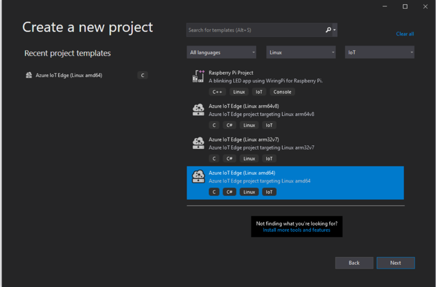
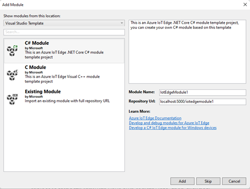
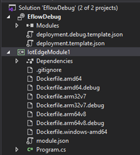
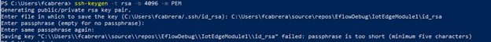
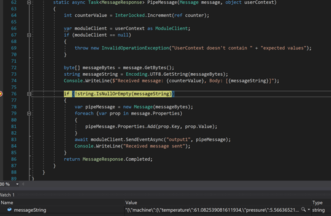

# Debug IoT Edge C# Linux Module with Visual Studio and EFLOW

Azure IoT Edge for Linux on Windows (EFLOW) allows you to easily develop, debug and deploy Azure IoT Edge Linux modules on top of a Windows device. To learn more about EFLOW, and Azure IoT Edge Tools, you can refer to the following documents:
-	[What is Azure IoT Edge for Linux on Windows](https://docs.microsoft.com/en-us/azure/iot-edge/iot-edge-for-linux-on-windows?view=iotedge-2018-06#:~:text=Azure%20IoT%20Edge%20for%20Linux%20on%20Windows%20allows%20you%20to,solutions%20being%20built%20in%20Linux.)
-	[Develop and debug modules in Visual Studio - Azure IoT Edge](https://docs.microsoft.com/en-us/azure/iot-edge/how-to-visual-studio-develop-module?view=iotedge-2020-11)

Remote debugging a module running inside the EFLOW VM is not straightforward. Therefore, this tutorial aims to demonstrate how to remotely debug a C# Linux mo
dule running inside EFLOW from the Window host OS. 

## Prerequisites
-	Windows device (Server/Client) running EFLOW. To learn more about EFLOW Installation and provisioning, check [Create and provision an IoT Edge for Linux on Windows device using symmetric keys - Azure IoT Edge.](https://docs.microsoft.com/en-us/azure/iot-edge/how-to-provision-single-device-linux-on-windows-symmetric?view=iotedge-2018-06&tabs=azure-portal%2Cpowershell)
-	Visual Studio 2019/2022
-	Azure IoT Edge Tools extension for Visual Studio
-	Docker Desktop on Windows

## Debug C / C# Module Container Running in Remote Edge Device


1)	Open Visual Studio 2019/2022 and click menu **File** -> **New** -> **Project**. In the New Project dialog, select **Platform** -> **Linux**, select **Project** **Type** -> **IoT**, and then choose **Azure IoT Edge (Linux amd64)**. Next, enter a name for your project, specify the location, and select **OK**.

<p align="left"></p>

2)	In the project wizard, select C# Module, and replace **localhost:5000** with your **own registry info**, then click **Yes**

<p align="left"></p>

3)	There are two projects in the solution:
      -  One is the IoT Edge module project, which is just a simple C# project
      -  The other, the Edge project, is called the same as you’re the Visual Studio solution.

<p align="left"></p>


4)	To debug the C# Linux module, we need to update **Dockerfile.amd64.debug** to enable SSH service. Update the **Dockerfile.amd64.debug** file to use the following template: [Dockerfile for Azure IoT Edge AMD64 C# Module with Remote Debug Support](./Dockerfile.amd64.debug)

5)	To establish an SSH connection with the Linux module, we need to create an RSA key. Open an elevated PowerShell session and run the following commands to create a new RSA key. 

     :warning: **Important:  _When asked for a directory, use the folder path where the IoTEdgeModule1 is stored_.**
     
     `ssh-keygen -t RSA -b 4096 -m PEM`

<p align="left"></p> 

6)	If you’re using a private registry like Azure Container Registry, use the following Docker command to sign in.

     `docker login -u <ACR username> -p <ACR password> <ACR login server>`

7)	Click **Show All Files** icon as below; a **.env** file should be displayed under the Edge project, named as your VS solution. Open the .env file to input credentials for your registry. These credentials will be used by IoT Edge runtime to pull/push module images after deployment. If the .env file is not created, go to the project folder, and make sure it’s not being hidden.

8)	Right-click on the Edge project and click **Build and Push IoT Edge Modules** to build, push the C# module to the container registry.

9)	Next, you’ll have to deploy the built module to the EFLOW device. There are multiple ways to deploy a module to an IoT Edge device. You may use the one you’re most comfortable with. For deployments using Azure:

     1) Go to Azure Portal
     2) Go to the IoT Edge device provisioned to the EFLOW VM
     3) Set Modules and add the recently built.
     4) We need to expose port 22 to access the module SSH service. Here we use 10022 as the host port, but you may specify a different port, which will be used as an SSH port to connect into the Linux C# moduler. Under “Container Create Options” make sure to include the following:

      ```yaml
      {
          "HostConfig": {
              "Privileged": true,
              "PortBindings": {
                  "22/tcp": [
                      {
                          "HostPort": "10022"
                      }
                  ]
              }
          }
      }
      ```
            
10)	Open an elevated PowerShell session
    1) Get the moduleId based on the name used for the Linux C# module
    
      `$moduleId = Invoke-EflowVmCommand “sudo docker ps -aqf name=<iot-edge-module-name>”`
      
    2) Check that the $moduleId is correct – If the variable is empty, make sure you’re using the correct module name
    3) Start the SSH service inside the Linux container
    
    `Invoke-EflowVmCommand “sudo docker exec -it -d $moduleId service ssh start”`
    
    4) Open the module SSH port on the EFLOW VM (in our case was 10022)
    
    `Invoke-EflowVmCommand “sudo iptables -A INPUT -p tcp --dport 10022 -j ACCEPT”`

      _Note: For security reasons, every time the EFLOW VM reboots, the IP table rule will delete and go back to the original settings. Also, the module SSH service will have to be started again manually._

11)	After successfully starting SSH service, click **Debug** -> **Attach to Process**, set Connection Type to SSH, and Connection target to the IP address of your EFLOW VM. If you don’t know the EFLOW VM IP, you can use the `Get-EflowVmAddr` cmdlet. First, type the IP and then press enter. In the pop-up window, input the following configurations:

      | Field               | Value                                                         |
      |---------------------|---------------------------------------------------------------|
      | **Hostname**            | Use the EFLOW VM IP                                           |
      | **Port**                | 10022 (Or the one you used in your deployment configuration)  |
      | **Username**            | root                                                          |
      | **Authentication type** | Private Key                                                   |
      | **Private Key File**    | Full path to the id_rsa that was previously created in Step 5 |
      | **Passphrase**          | The one used for the key created in Step 5                    |
      
<p align="left"></p>

12)	After successfully connecting to the module using SSH, then you can choose the process and click **Attach**. For the C# module you need to choose process **dotnet** and **“Attach to” to Managed (CoreCLR).**
 
 <p align="left"></p>

13)	Now you can set breakpoint and debug your C# Linux module from Visual Studio on Windows. 

 <p align="left"></p>
