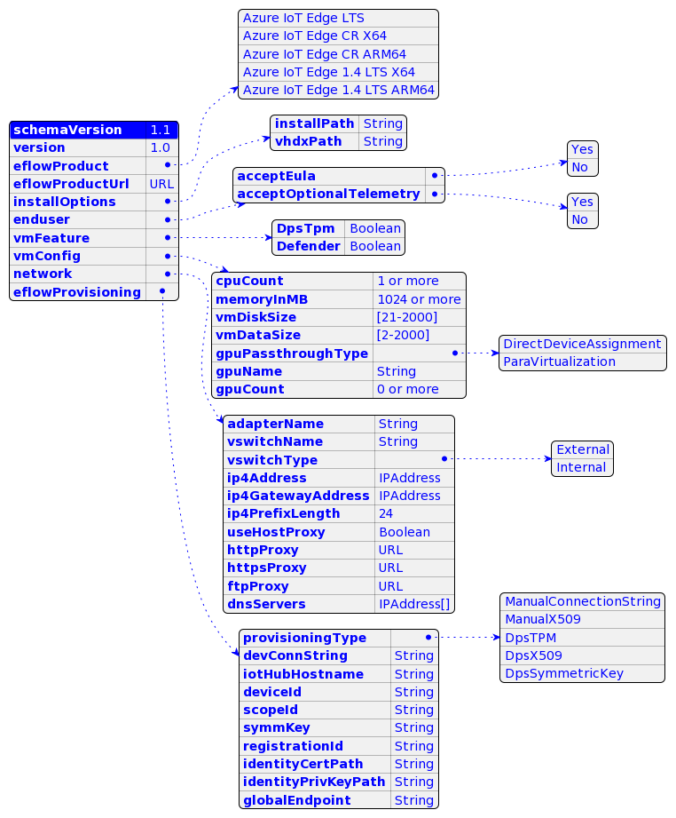

# EFLOW Auto Deploy

eflowAutodeploy enables you to automate the Azure IoT Edge for Linux on Windows (EFLOW) installation, deployment and provisioning easily with a simple json specification.

The script does the following:

- Installs the required version of the EFLOW
- Validate the json parameters
- Creates the required network switch
- Deploys the EFLOW virtual machine and configures features,proxy, dnsServers
- Provisions the EFLOW virtual machine with the IoT Edge provisioning info
- Verifies the EFLOW virtual machine is up and running

## Usage

### Autodeploy steps

1. Populate the *eflow-userconfig.json* with the desired parameters and values and place it in the same folder as *eflowAutoDeploy.ps1*.
2. Run the below command to autodeploy using *eflow-userconfig.json*.

```powershell
.\eflowAutoDeploy.ps1 -AutoDeploy
```

### Interactive steps

Alternatively, you can *dot source* the script and invoke functions individually.

1. Populate the *eflow-userconfig.json* with the desired parameters and values.
2. *dot source* the script and call `Start-EadWorkflow` with the json file as input. This will perform the full deployment.

```powershell
. .\eflowAutoDeploy.ps1
Start-EadWorkflow 'C:\MyConfigs\eflow-userconfig.json'
```
## JSON schema

The below table provides the details of the supported parameters in the json file. For more information about specific parameters, check [PowerShell functions for Azure IoT Edge for Linux on Windows](https://aka.ms/AzEFLOW-PowerShell).

| Parameter | Required | Type / Values | Comments |
| --------- | -------- |---------------- | -------- |
| schemaVersion | Mandatory | 1.1 | Fixed value, schema version. Reserved. Added ftpProxy and useHostProxy |
| Version | Mandatory | 1.0 | Fixed value, json instance version. Reserved |
| eflowProduct | Mandatory | <ul><li>Azure IoT Edge LTS</li><li>Azure IoT Edge CR X64</li><li>Azure IoT Edge CR ARM64</li><li>Azure IoT Edge 1.4 LTS X64</li><li>Azure IoT Edge 1.4 LTS ARM64</li></ul>| Supported EFLOW product versions |
| eflowProductUrl | Optional | String (url) | Download Url to install specific  Eflow versions. (Eg. https://aka.ms/AzEFLOW-1_1_2203_14042) |
| *enduser* | |  | *End user configuration* |
| acceptEula | Mandatory | Yes |  Accept Eula |
| acceptOptionalTelemetry | Optional | Yes | Accept optional telemetry |
| *network* | *Optional* | |*Network configuration optional for Client SKU. Mandatory for Server SKU*|
| vswitchType | Mandatory | <ul><li>External</li><li>Internal</li></ul> | `Internal`  is supported for Server SKU only |
| vswitchName | Mandatory | String | Switch name to use |
| ip4Address | Optional | IPAddress |  Static IP Address for the EFLOW VM |
| ip4GatewayAddress | Optional | IPAddress | Static Gateway IP Address |
| ip4PrefixLength | Optional | 24 | IP PrefixLength |
| useHostProxy | Optional | Boolean |if true, the host PC proxy configuration will be applied to the VM as well |
| httpProxy | Optional | Url | httpProxy link |
| httpsProxy | Optional | Url | httpsProxy link |
| ftpProxy | Optional | Url | ftpProxy link |
| dnsServers | Optional | String[] | Array of valid dns servers for VM |
| *vmConfig* | *Optional*|  | *VM configuration* |
| cpuCount | Optional |0 | cpuCount|
| memoryInMB | Optional |0| memoryInMB|
| vmDiskSize | Optional |21-2000| Size in GB|
| vmDataSize | Optional | 2-2000| Size in GB, not supported in LTS|
| gpuPassthroughType | Optional |<ul><li>DirectDeviceAssignment</li><li>ParaVirtualization</li></ul>| gpuPassthroughType|
| gpuName | Optional |String| gpuName|
| gpuCount | Optional |0| gpuCount|
| *vmFeature* | *Optional*|  | *Features*  |
| DpsTpm| Optional |Boolean| Enable TPM for DPS|
| Defender| Optional |Boolean| Enable Defender feature in VM|
| *eflowProvisioning* | *Optional*|  | *Provisioning configurations*  |
| provisioningType| Optional |<ul><li>ManualConnectionString</li><li>ManualX509</li><li>DpsTPM</li><li>DpsX509</li><li>DpsSymmetricKey</li></ul>| Supported provisioning types|
| devConnString| Optional |String| Mandatory for *ManualConnectionString*|
| iotHubHostname| Optional |String| Mandatory for *ManualX509*|
| deviceId| Optional |String| Mandatory for *ManualX509*|
| identityCertPath| Optional |String| Mandatory for *ManualX509*,*DpsX509*|
| identityPrivKeyPath| Optional |String| Mandatory for *ManualX509*,*DpsX509*|
| scopeId| Optional |String| Mandatory for *DpsTPM*,*DpsX509*,*DpsSymmetricKey*|
| symmKey| Optional |String| Mandatory for *DpsSymmetricKey*|
| registrationId| Optional |String| Mandatory for *DpsSymmetricKey*|
| globalEndpoint| Optional |String| DPS endpoint|

## JSON schema visualization


## Supported Functions

| Functions |   Description |
|:------------ |:-----------|
|`Start-EadWorkflow`| Main funtion that validates the user config, installs eflow, creates switch, deploys and provisions VM |
| **Config Functions** |  |
|`Get-EadUserConfig`| Returns the json object that is cached |
|`Set-EadUserConfig`| Sets the user config and reads the config into the cache |
|`Read-EadUserConfig`| Reads the json file into the cache |
| **Test Functions** |  |
|`Test-EadUserConfig`| Tests the User Config json for parameter correctness |
|`Test-EadUserConfigInstall`| Tests the Install specific parameters |
|`Test-EadUserConfigDeploy`| Tests the deployment specific parameters |
|`Test-EadUserConfigProvision`| Tests the provisioning specific parameters|
|`Test-EadUserConfigNetwork`| Tests the network specific parameters|
|`Test-EadEflowVmDeploy`| Tests if the EFLOW VM is deployed (present) |
|`Test-EadEflowVmProvision`| Tests if the EFLOW VM is provisioned |
|`Test-EadEflowVmRun`| Tests if the EFLOW VM is running in the machine |
|**VM Switch Functions** ||
|`New-EadEflowVmSwitch`| Creates an new VM switch based on user config. If Internal switch is specified, it also assigns a static ip address (no DHCP used) |
|`Test-EadEflowVmSwitch -Create`| Tests if the VM switch is present, `Create` flag invokes New-EadEflowVmSwitch if switch is not present |
|`Remove-EadEflowVmSwitch`| Removes the VM switch if present. Also removes the Nat if created (for internal switch) |
|**Deployment functions**||
|`Invoke-EadEflowDeploy`| Validates the deployment parameters in user json and deploys EFLOW VM|
|`Invoke-EadEflowProvision`| Validates the provisioning parameters in user json and provisions EFLOW VM|
|**Install functions**||
|`Get-EadEflowInstalledVersion`| Returns the installed product name and version (comma separated) or Null if none found|
|`Invoke-EadEflowInstall`| Installs the requested product from the eflowProductUrl if specified, otherwise it installs the latest (default)|
|`Test-EadEflowInstall -Install`| Tests if EFLOW is installed and `Install` switch is specified, it installs when not found|
|`Remove-EadEflowInstall`| Removes the installed EFLOW product|
|**Helper functions**||
|`Get-HostPcInfo`| Gets the PC information such as OS version etc|
|`Test-AdminRole`| Checks if the Powershell session is in Admin mode|
|`Test-HyperVStatus -Install`| Checks if Hyper-V is installed and if `Install` switch is specified, it installs Hyper-V feature. *Requires reboot*.|
