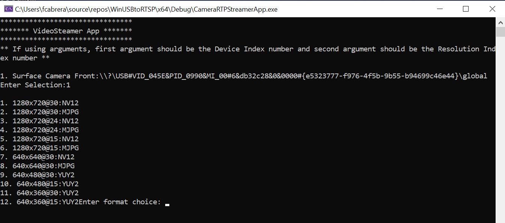

# Camera passthrough

## Introduction
Suppose in a workflow, you have an application that works with an RTSP video feed. When moving the workflow to run on the EFLOW VM, you may have problems accessing the video feed since the EFLOW VM is isolated from the USB/IP cameras attached to the Windows host.

This article describes how to configure the EFLOW VM and host to redirect video feeds over the network. With the redirection, applications running on the EFLOW VM can access video feeds and cameras attached to the Windows host.

This sample demonstrates how to passthrough a USB/IP camera to the EFLOW VM using Windows Media Foundation. This repo was initially forked from the [Network Video Streamer repo](https://github.com/microsoft/Windows-Camera/tree/release/NetworkVideoStreamer_1_0).

## The scenario

You have some cameras connected to your host, and you want to make use of those cameras in applications running on the EFLOW VM (the **client**).

Since the client and server are both connected to a Hyper-V virtual switch, we can redirect the camera video feed over the network.  The application running on the client will only need to know how to handle RTSP video feeds.

On the other end, the server needs to connect to the cameras using Windows stack of drivers, get the camera video feed, and create an RTSP server for the client's app to connect to. 

The following diagram shows the architecture described:
```
     Client (EFLOW VM)                                                   Server (Windows Host)          
+------------------------+                                            +------------------------+
|      RTSP Client       | ................ (network) ................|  Camera to RTSP server |
+------------------------+                                            +------------------------+
                                                                                  | USB/Bluetooth/IP
                                                                                  |
                                                                          +---------------+
                                                                          |    Camera     |
                                                                          +---------------+
```


## Run Sample

This part describes how to develop the Windows console application in the development VM. You can follow the [Build and run a C++ console app project](https://docs.microsoft.com/cpp/build/vscpp-step-2-build) guide.

1. Open the Windows application sample - Use Visual Studio running as Admin.
     - Network Media Streamer: `WinUSBtoRTSP\NetworkMediaStreamer.sln`

2. Setup 'CameraStreamerApp' as the startup project

3. On the top pane, set build to 'Release' and select the 'x64' architecture, and build the project.

4. The output path for the .exe package can be found in the below location.
     - Network Media Streamer: `WinUSBtoRTSP\x64\Release\CameraRTSPStreamer.exe`
   
5. Run the 'CameraRTSPStreamer.exe' as an Administrator

> **Note:** If you are using RTSPS, make sure a local certificate is installed 

6. There are two different usage modes:

a. **Command Line** Interactive screen where the user program will list the cameras availables and the user selects the camera. Once the camera is selected, a list of the supported formats will be displayed, and the user has to select the format wanted.

   


b. **Arguments Mode:** Run the program with four arguments; this mode will not provide an interactive screen and will use the arguments instead

     1. Index Camera number
     2. Index Format number
     3. RTSP Server Port
     4. RTSP Secure Server Port
