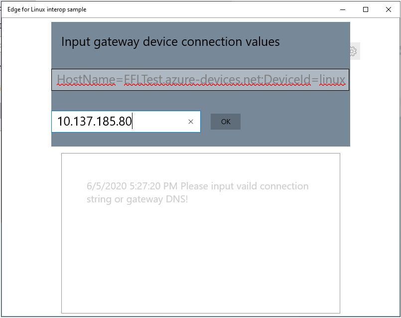
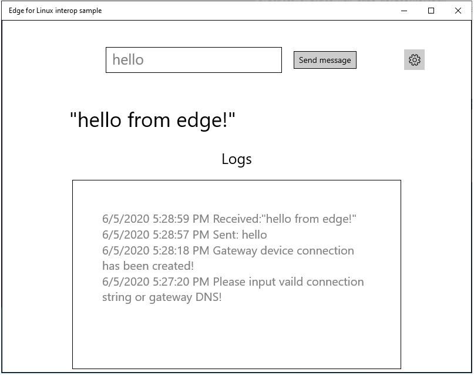
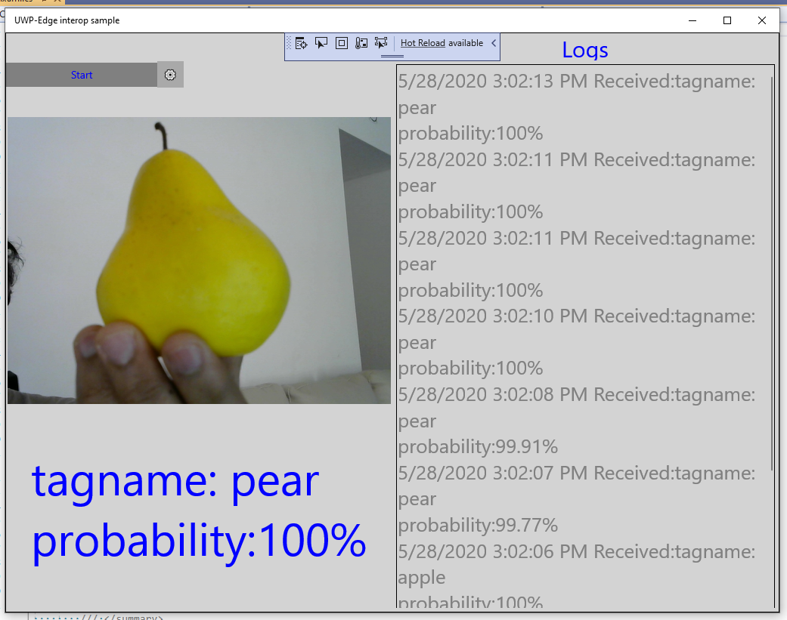
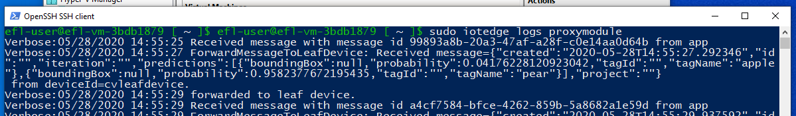
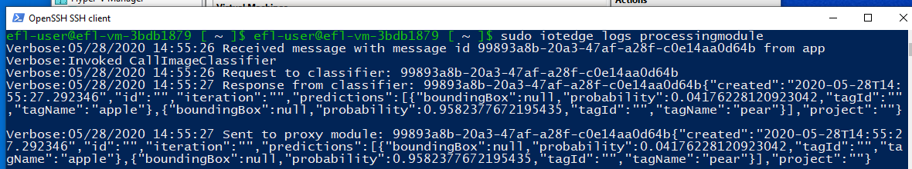
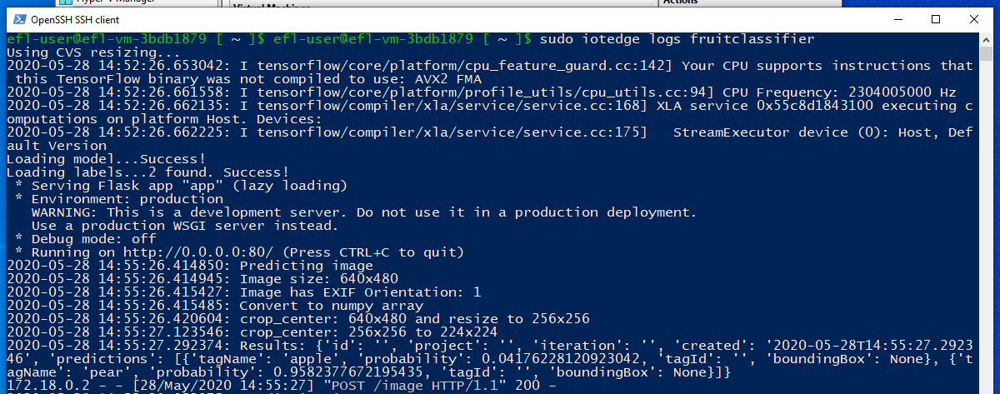

# Interop Console App with Linux Edge Module
## Progress

- [x] [Introduction](../README.md)  
- [x] [Step 1 - Setup Development Environment](./Setup%20DevVM.MD)   
- [x] [Step 2 - Setup Azure Resources](./Setup%20Azure%20Resources.MD)  
- [x] [Step 3 - Setup Azure IoT Edge for Linux on Windows](./Setup%20Azure%20IoT%20Edge%20for%20Linux%20on%20Windows.MD)
- [x] [Step 4 - Develop and publish the IoT Edge Linux module](./Develop%20and%20publish%20the%20IoT%20edge%20Linux%20module.MD)  
- [x] [Step 5 - Create Certificates for Authentication](./Create%20Certificates%20for%20Authentication.MD)  
- [x] [Step 6 - Develop the Windows C# Console Application](./Develop%20the%20Windows%20C%23%20Console%20Application.MD)  
- [x] [Step 7 - Configuring the IoT Edge Device](./Configuring%20the%20IoT%20Edge%20Device.MD)  
- [ ] **Step 8 - Run samples**  
- [ ] [Troubleshooting](./Troubleshooting.MD) 
---

# Step 8: Run samples
## Steps to run the Showcase

Having restarted the 'iotedge' service and verified that iotedge is configured correctly, wait until the sample modules are pulled from the IoT Hub. Once the modules are running, the sample setup is ready to take messages from our Windows application.

### For text messaging interop:

- Run the application 'Azure IoT Edge for windows in linux interop sample' and use its GUI to send messages to the Linux module. In this revision, the Windows application runs natively on the Windows IoT device and is not isolated inside a container.

- Right click on the app, it would prompt for connection string and gateway DNS name. Enter the leaf device connection string that you have captured above and the Linux environment's IP address as gateway device. The logs show whether the connection was established successfully.

    

- Enter a message such as "hello" and click on "Send message"
- The logs will show that you have sent the message and received a reply "hello from edge" from the Linux module.

   

- Use the following commands in the Linux environment to see messages passed from the Windows application to the Linux module.

   ```
   sudo iotedge logs processingmodule
   sudo iotedge logs proxyModule
   ```

### For custom vision sample interop:
- Run the application 'UWP-Edge interop sample' and use its GUI to send messages to the Linux module.
- In this revision, the Windows application runs natively on the Windows IoT device and is note isolated inside a container.
- Right click on the app, it would prompt for connection string and gateway DNS name. Enter the leaf device connection string that you have captured above and Linux environment IP address as gateway device. You would see the logs that the connection established successfully.
- Click on "Start", it will start sending the image frames over to the IoT Edge module.
- Show "apple fruit" against the camera. The app would display the probability of the object classification at the bottom of the camera preview.

  

- Use the command `sudo iotedge logs processingmodule`, `sudo iotedge logs proxymodule`, `sudo iotedge logs fruitclassifier` in the Linux environment to see the messages passed from the Windows application to the Linux module.

   #### Proxymodule logs ####
   

   #### Processingmodule logs ####
   

   #### Fruitclassifier module logs ####
   

Go to [Next Step](./Troubleshooting.MD)  
