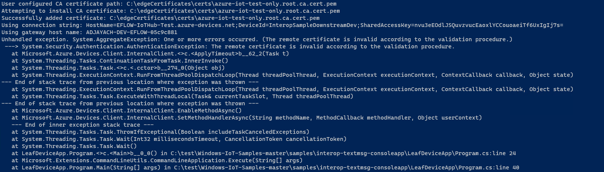
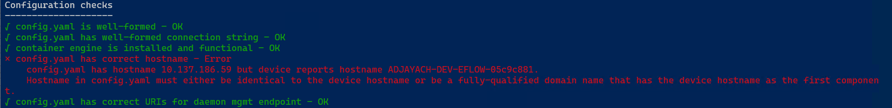

## Troubleshooting

## Progress

- [x] [Introduction](../README.md)  
- [x] [Step 1 - Setup Development Environment](./Setup%20DevVM.MD)   
- [x] [Step 2 - Setup Azure Resources](./Setup%20Azure%20Resources.MD)
- [x] [Step 3 - Setup Azure IoT Edge for Linux on Windows](./Setup%20Azure%20IoT%20Edge%20for%20Linux%20on%20Windows.MD)
- [x] [Step 4 - Develop and publish the IoT Edge Linux module](./Develop%20and%20publish%20the%20IoT%20edge%20Linux%20module.MD)  
- [x] [Step 5 - Create Certificates for Authentication](./Create%20Certificates%20for%20Authentication.MD)  
- [x] [Step 6 - Develop the Windows C# Console Application](./Develop%20the%20Windows%20C%23%20Console%20Application.MD)  
- [x] [Step 7 - Configuring the IoT Edge Device](./Configuring%20the%20IoT%20Edge%20Device.MD)  
- [x] [Step 8 - Deploy the Modules onto the IoT Edge Device](./Deploy%20the%20Modules%20onto%20the%20IoT%20Edge%20Device.MD)  
- [x] [Step 9 - Run the Console Application](./Run%20the%20Console%20Application.MD)
- [ ] **Troubleshooting**    
---


#### 1. Console message app shows TLS Error ####
This problem is usually caused by a gateway issue. On the IoT Edge device configuration (/etc/iotedge/config.yaml) there's a section called hostname. This automatically gets populated with the system hostname. In some cases, hostname is not found and the user will have to use the EFLOW VM IP. Ensure the gateway name in the C# Windows app matches the hostname in the IoT Edge config.yaml. 



If the previous steps doesn't work, follow these steps:
1. In the config.yaml, change the hostname to the IP address of the EFLOW VM. 
2. `sudo systemctl restart aziot*` 
3. `sudo systemctl status aziot*` - Make sure it says active (running)  
4. `sudo iotedge check` 
5. Run the c# console app using the IP address for the gateway address insted of the hostname
<br/>


> **Note:** You might get an error related to "correct hostname"; however the IoT Edge shoudl work correctly anyway
> 


#### 2. Error when pushing a module to Azure Contianer Registry ####
To fix an error when pushing the container, ensure that the module.json has the proper registry and container name appended: <repository>.azurecr.io/<containername>. For more information, visit [Can't Push IoT Edge module to Azure Container Registry](https://github.com/MicrosoftDocs/azure-docs/issues/22296).
<br/><br/>

#### 3. Error when pushing a deploying the CSharpModule app ####
To fix this error,  change InteropSampleRegistry value in the registry credentials to direct values or add a separate environment variable for the registry container.
<br/><br/>

#### 4. Operation is not valid due to the current state of the object in microsoft.azure.amqp ####
This is a bug in AMQP and .NET 5. For more information about this error, check this [thread](https://stackoverflow.com/questions/64804036/operation-is-not-valid-due-to-the-current-state-of-the-object-source-microsoft). The solution is adding AMQP version requirement, as well as using .NET Core 3.1LTS  instead of .NET 5
```csharp
<PackageReference Include="Microsoft.Azure.Amqp" Version="2.4.13" /> 
```
<br/>

#### 5. Modules not showing up in the IoT Edge device ####
This error is generally related to an authentication issue when pulling the module from the container registryl. For further information, use the IoTEdge logs.
```powershell
sudo iotedge logs edgeAgent 
sudo iotedge logs edgeHub 
```
