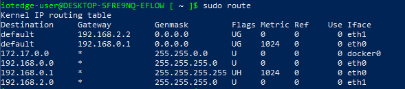

# EFLOW Routing

When using EFLOW multiple NICs feature, you may want to set up the different routes priorities. By default, EFLOW will create one _Default_ route per _ehtX_ interface assigned to the VM and assign a random priority.
If all interfaces are connected to the internet, random priorities may not be a problem. However, if one of the NICs is connected to an _Offline_ network, you may want to prioritize the _Online_ NIC over the _Offline_ NUC to get the EFLOW VM connected to the internet. 

The following diagram shows the architecture described:
```
        Secure Network                                      EFLOW VM                                  Internet
      +----------------+                                                                                 |
      | Offline Device |                                                                                 |
      +----------------+                                                                                 |
             |                                        +--------------+                           +------------------+
             |                                        |     eth0     | ... ( online network) ... |  Online Router   |
             |                                        +--------------+                           +------------------+
+------------------------+                            +--------------+
|     Offline Router     | ... ( offline network) ... |     eth1     |
+------------------------+                            +--------------+                                                                                                                                           
```

## Route

EFLOW uses [route](https://man7.org/linux/man-pages/man8/route.8.html) service to manage the network routing alternatives. In order to check the available EFLOW VM routes, use the following steps:

1. Open an elevated PowerShell session
2. Connect to the EFLOW VM using `Connect-EflowVm`
3. Run `sudo route`



_Image above shows the route command output with two NIC's assigned (eth0 and eth1). The VM will create two different _Default_ destinations rules with different Metrics (priorities - the lower the metric, the higher the priority)._


## Static Routes fix
Every time EFLOW VM starts, it will recreate all routes, and any previously assigned priority could change. A workaround to this scenario would be to assign the desired priority for each route, every time the VM starts. We can create a service that is executed every time the VM starts and use the `route` command to set the desired route priorities.

First, create a bash script that will execute the necessary commands to set the routes. For example, imagine you had an EFLOW VM that has two NICs. First NIC, **eth0**, is connected using the GW IP xxx.xxx.xxx.xxx. The second NIC, **eth1**, is connected using the GW IP yyy.yyy.yyy.yyy. 

The script below will reset the _Default_ routes for both eth0 and eth1, and set them using a desire <number> metric.
_Remember: The lower the metric, the higher the priority._ 

```
#!/bin/sh

# Wait 30s for the interfaces to be up
sleep 30

# Delete previous eth0 route and create a new one with desired metric
sudo ip route del default via xxx.xxx.xxx.xxx dev eth0
sudo route add -net default gw xxx.xxx.xxx.xxx netmask 0.0.0.0 dev eth0 metric <number>

# Delete previous eth1 route and create a new one with desired metric
sudo ip route del default via yyy.yyy.yyy.yyy dev eth1
sudo route add -net default gw yyy.yyy.yyy.yyy netmask 0.0.0.0 dev eth1 metric <number>
```

You can use the above script to create your own custom script specific to your networking scenario. Once script is defined, make sure you save it and assign execute permission. E.g if the sciprt name is _route-setup.sh_, you can assign execute permission using the command `sudo chmod +x route-setup.sh`. You can test if the script is running by executing it manually using the command `sh ./route-setup.sh` and then checking the routing table using the `sudo route` command. 
        
The final step is to create a Linux service that will run on startup, and execute the bash script to set the routes. You wil have to create a systemd unit file, to load the service. Below is an example of that file.
        
```
[Unit]
after=network

[Service]
Type=simple
ExecStart=/bin/bash /home/iotedge-user/route-setup.sh

[Install]
WantedBy=default.target
```

 To check the service is working, reboot the EFLOW VM (`Stop-EflowVm` & `Start-EflowVm`),  then `Connect-EflowVm` to get inside the VM, and finanlly list the routes. You should be able to see the new _Default_ rules, with the assinged metric.
      
