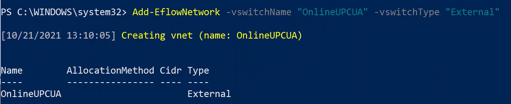
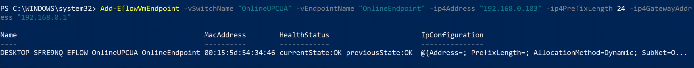

# EFLOW Industrial IoT OPC UA scenario using multiple NIC support
## Progress

- [x] [Introduction](../README.md)  
- [x] [Step 1 - Setup OPC UA devices]() 
- [x] [Step 2 - Install Azure IoT Edge for Linux on Windows (EFLOW)]()
- [ ] **Step 3 - Configure EFLOW Multiple NIC**
- [ ] [Step 4 - Provision EFLOW and Configure OPC Publisher](./Develop%20the%20Windows%20C%23%20Console%20Application.MD)  
- [ ] [Troubleshooting](./Troubleshooting.MD)  
---

# Step 3 - Configure EFLOW Multiple NIC
The EFLOW VM was deployed with an External virtual switch connected to the Secure Network (offline) in the previous steps. To provision the EFLOW VM and communicate with Azure, we need to assign another NIC that is connected to the DMZ network (online). For this demo, we will assign an External Virtual Switch connected to the DMZ network. For more information, review [Create a virtual switch for Hyper-V virtual machines](https://docs.microsoft.com/en-us/windows-server/virtualization/hyper-v/get-started/create-a-virtual-switch-for-hyper-v-virtual-machines). 

To create the new virtual switch, follow these steps:

1. Open Hyper-V Manager.
2. On the right bar, select Virtual Switch Manager. 
3. On the Virtual Switch Manager window, select New Virtual network switch on the left bar.
4. Select type _External_ and click _Create Virtual Switch_.
5. Use a name that represents the Secure network, like _OnlineOPCUA_.
6. Under _Connection Type_, select _External Network_ and select the Network Adapter connected to your DMZ network.
7. Select _Apply_.

Once the External Virtual Switch is created, we need to attach this VM switch to the EFLOW VM. For more information, check [EFLOW Multiple NICs](https://github.com/Azure/iotedge-eflow/wiki/Multiple-NICs). For our custom new External Virtual Switch, using Static IP, the necessary commands are the following: 

1. `Add-EflowNetwork -vswitchName OnlineOPCUA -vswitchType External`

2. `Add-EflowVmEndpoint -vswitchName OnlineOPCUA -vEndpointName OnlineEndpoint -ip4Address 192.168.0.103 -ip4PrefixLength 24 -ip4GatewayAddress 192.168.0.1`

If everything is correct, we will have the _OnlineOPCUA_ switch assigned to the EFLOW VM. To check the multiple NIC attachment, use the following steps:

1. Open a PowerShell session.
2. Run the command `ipconfig`.
3. Check the IP configuration - Make sure you see the eth0 interface (connected to the Secure network) and the eth1 interface (connected to the DMZ network).

**To learn more about EFLOW Multiple NIC**  
 * For more information, review [EFLOW docs](https://docs.microsoft.com/azure/iot-edge/iot-edge-for-linux-on-windows).
 * If there's an issue with the network routing, check [EFLOW Network Routing](./routing/README.md).