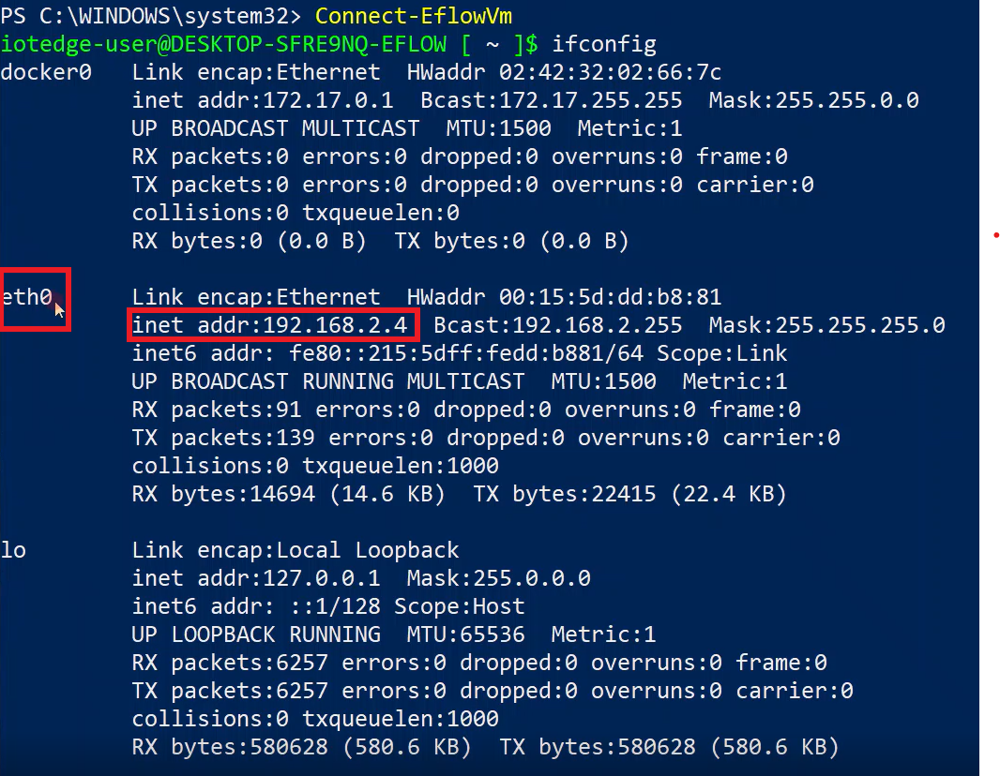
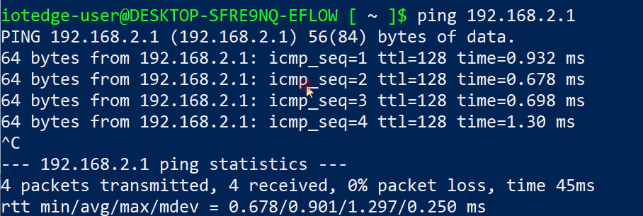

# EFLOW Industrial IoT OPC UA scenario using multiple NIC support
## Progress

- [x] [Introduction](../README.md)  
- [x] [Step 1 - Setup OPC UA devices](./Setup%20OPC%20UA%20Devices.MD) 
- [ ] **Step 2 - Install Azure IoT Edge for Linux on Windows (EFLOW)**  
- [ ] [Step 3 - Configure EFLOW Multiple NIC](./Configure%20EFLOW%20Multiple%20NIC.MD)  
- [ ] [Step 4 - Provision EFLOW and Configure OPC Publisher](./Provision%20EFLOW%20and%20Configure%20OPC%20Publisher.MD)  
- [ ] [Troubleshooting](./Troubleshooting.MD)  
---

# Step 2: Install Azure IoT Edge for Linux on Windows (EFLOW)
This part describes the relevant steps to set up Azure IoT Edge for Linux on Windows (EFLOW).

Before deploying the EFLOW Virtual Machine, we need to create an _External Virtual switch_ to connect to the Secure (offline) network. For more information, review [Create a virtual switch for Hyper-V virtual machines](https://docs.microsoft.com/en-us/windows-server/virtualization/hyper-v/get-started/create-a-virtual-switch-for-hyper-v-virtual-machines).

1. Open Hyper-V Manager.
2. On the right bar, select Virtual Switch Manager. 
3. On the Virtual Switch Manager window, select the New Virtual network switch on the left bar.
4. Select type _External_ and click _Create Virtual Switch_.
5. Use a name that represents the Secure network, like _OfflineUPCUA_.
6. Under _Connection Type_, select _External Network_ and select the Network Adapter connected to your Secure network.
7. Select _Apply_.

If everything is correct, we'll have a new External virtual switch that we will use to connect the EFLOW VM directly to the Secure network. 

To install EFLOW, follow the instructions [Install Azure IoT Edge for Linux on Windows](https://docs.microsoft.com/en-us/azure/iot-edge/how-to-provision-single-device-linux-on-windows-symmetric?view=iotedge-2018-06&tabs=powershell) until Step 4 (`Deploy-Eflow`). Make sure to deploy the EFLOW VM using the command `Deploy-Eflow` with the recently created switch. 

For information about all the optional parameters available, see [PowerShell functions for IoT Edge for Linux on Windows](https://docs.microsoft.com/en-us/azure/iot-edge/reference-iot-edge-for-linux-on-windows-functions?view=iotedge-2018-06#deploy-eflow). If you are using Static IP, make sure to specify the IP parameters (-ip4Address, ip4PrefixLength, ip4GatewayAddress). 

For example, for our custom External Virtual Switch, with Static IP, the command would be the following: 

`Deploy-Eflow -cpuCount 2 -memoryInMb 2048 -vswitchName OfflineUPCUA -vswitchType External -ip4Address 192.168.2.4 -ip4PrefixLength 24 -ip4GatewayAddress 192.168.2.1`.

Once installation is completed, check that the EFLOW VM has connectivity with the OPC UA devices. You can check the connectivity by pinging the offline devices (make sure ICMP traffic is allowed in Windows Firewall).
1. Open an elevated PowerShell Session.
2. Connect to the EFLOW VM using the command `Connect-EflowVm`.
3. Inside the VM, do an `ifconfig` to check the eth0 interface has the correct IP configuration

4. Test connectivity by pinging the OPC UA Simulation Server device: `ping <OPC-UA-Device-IP>`

* For more information, review [EFLOW docs](https://docs.microsoft.com/azure/iot-edge/iot-edge-for-linux-on-windows).
 

 Go to [Next Step](./Configure%20EFLOW%20Multiple%20NIC.MD)  

