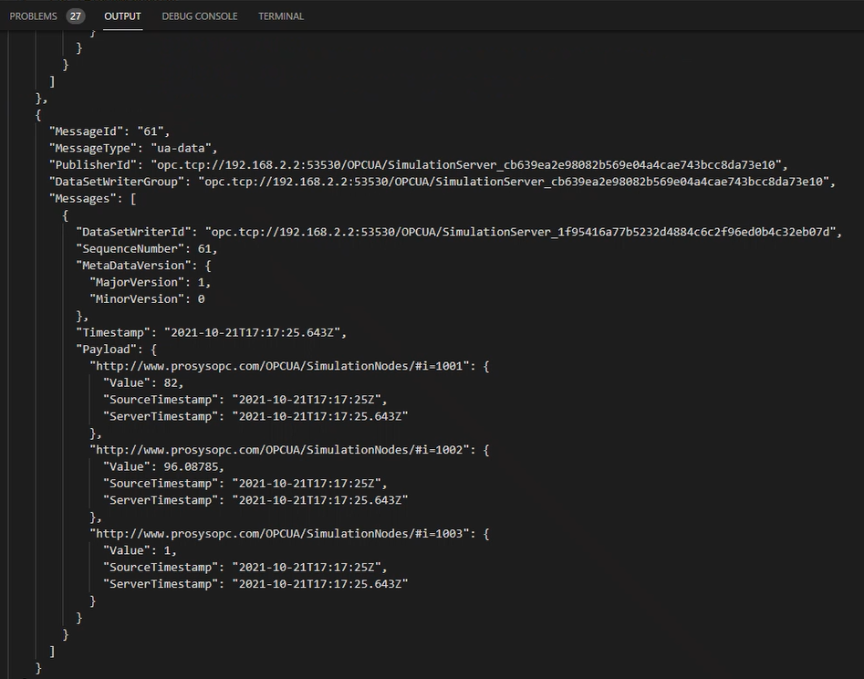

# EFLOW Industrial IoT OPC UA scenario using multiple NIC support
## Progress

- [x] [Introduction](../README.md)  
- [x] [Step 1 - Setup OPC UA devices](./Setup%20OPC%20UA%20Devices.MD) 
- [x] [Step 2 - Install Azure IoT Edge for Linux on Windows (EFLOW)](./Install%20Azure%20IoT%20Edge%20for%20Linux%20on%20Windows.MD)
- [x] [Step 3 - Configure EFLOW Multiple NIC](./Configure%20EFLOW%20Multiple%20NIC.MD)
- [ ] **Step 4 - Provision EFLOW and Configure OPC Publisher**
- [ ] [Troubleshooting](./Troubleshooting.MD)  
---

# Step 4- Provision EFLOW and Configure OPC Publisher

### Provision EFLOW VM
To complete the demo, we first need to provision the EFLOW VM and get the OPC Publisher module deployed. EFLOW supports multiple provisioning methods. For more information check [Create and Provision and IoT Edge device](https://docs.microsoft.com/en-us/azure/iot-edge/how-to-create-iot-edge-device?view=iotedge-2018-06). For the purpose of this sample code, we will use Manual Connection String. 

`Provision-EflowVm -provisioningType ManualConnectionString -devConnString <edge-device-connection-string>`.

### Deploy OPC Publisher

Once the EFLOW VM is provisioned, follow [Tutorial: Deploy the OPC Publisher](https://docs.microsoft.com/en-us/azure/industrial-iot/tutorial-publisher-deploy-opc-publisher-standalone) guide to deploying the OPC Publisher module to the EFLOW VM.

### COnfigure OPC Publisher

The last step is to configure the OPC Publisher module to connect with the OPC UA Simulation Server. Follow the [Tutorial: Configurar OPC Publisher](https://docs.microsoft.com/en-us/azure/industrial-iot/tutorial-publisher-configure-opc-publisher). Make sure to edit the configuration file taking into account the scenario networking configuration. Under _EndpointUrl_ use the OPC UA Simulation Server connection string that was previously tested with the OPC UA Client. 

If everything is working ok, you should be able to open Visual Studio Code, and use the Azure IoT Hub extension, subscript to the EFLOW VM Edge device messages, by following these steps:

1. Open Visual Studio Code.
2. Make sure you have the [Azure IoT Hub VSCode extension](https://marketplace.visualstudio.com/items?itemName=vsciot-vscode.azure-iot-toolkit).
3. Go to the Azure IoT Hub list of devices
4. Select the EFLOW Edge device, right-click and click _Start Monitoring Built-in Event Endpoint_.

