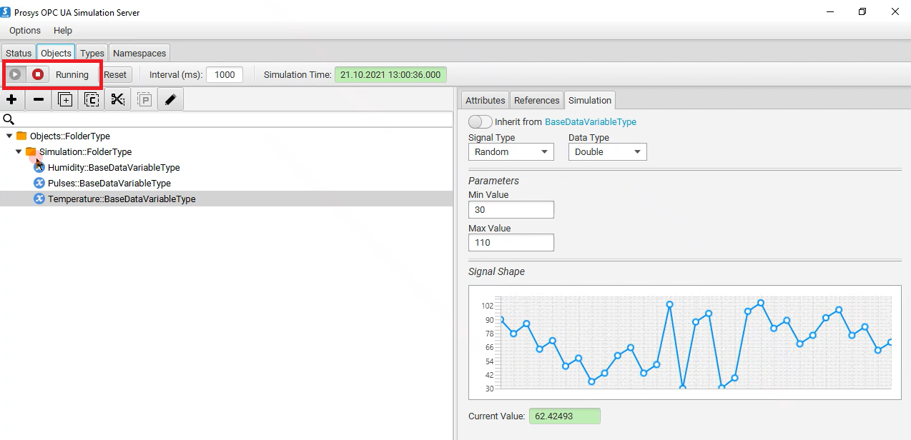
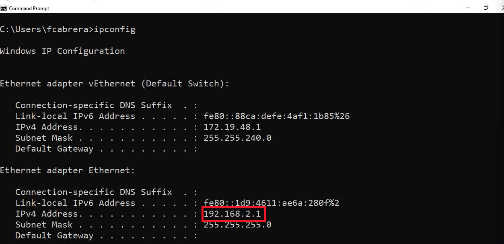
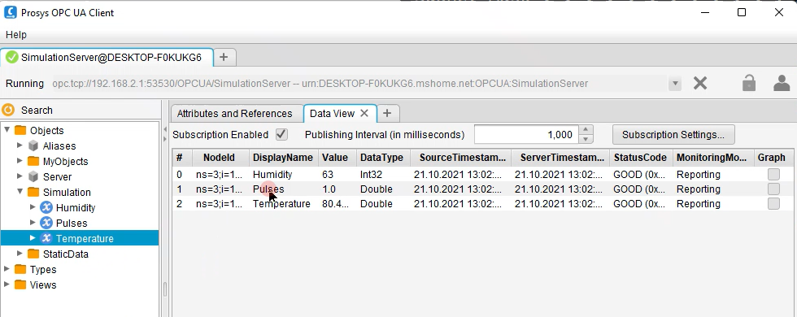

# EFLOW Industrial IoT OPC UA scenario using multiple NIC support
## Progress

- [x] [Introduction](../README.md)  
- [ ] **Step 1 - Setup OPC UA devices** 
- [ ] [Step 2 - Install Azure IoT Edge for Linux on Windows (EFLOW)](./Develop%20and%20publish%20the%20IoT%20edge%20Linux%20module.MD)  
- [ ] [Step 3 - Configure EFLOW Multiple NIC](./Create%20Certificates%20for%20Authentication.MD)  
- [ ] [Step 4 - Provision EFLOW and Configure OPC Publisher](./Develop%20the%20Windows%20C%23%20Console%20Application.MD)  
- [ ] [Troubleshooting](./Troubleshooting.MD)  
---

# Step 1 - Setup OPC UA devices
This part describes the relevant steps to setup OPC UA Server simulators to test the EFLOW Industrial IoT scenario described before. There are different OPC UA Server simulators. For the purpose of this sample code, we will use [Prosys OPC UA Simulation Server](https://www.prosysopc.com/products/opc-ua-simulation-server/). This program will simulate OPC UA devices information that we will publish to Azure using OPC UA Publisher module. 

## Setup OPC UA Server Simulator
1. Download [Prosys OPC UA Simulation Server](https://www.prosysopc.com/products/opc-ua-simulation-server/evaluate/).
2. Run the installer.
3. Run Prosys OPC UA Simulation Server.
4. Navigate to Objects, and check the simulated parameters. If needed, change the Name and the value creation method.
5. Make sure the Simulator is running.

## Check IP configuration
1. Open a PowerShell session.
2. Run the command `ipconfig`.
3. Check the IP configuration - Make sure you get the IP Address of the switch connected to the offline network. In our case, it's the Ethernet adapter, with the IP Address 192.168.2.1

## Check connectivity to the OPC UA Simulation Server
Before installing EFLOW and connecting the OPC UA Publisher to the offline devices, we will test that the Windows host can access the OPC UA Simulation Server data. There are different OPC UA Clients; in particular, we will use [Prosys OPC UA Client](https://downloads.prosysopc.com/opc-ua-client-downloads.php). 

1. Download [Prosys OPC UA Client](https://www.prosysopc.com/opcua/apps/JavaClient/dist/3.2.0-328/prosys-opc-ua-client-3.2.0-328.exe).
2. Run the installer.
3. Run Prosys OPC UA Client.
4. Get the Connection string from the OPC UA Simulation Server.
5. Copy the Connection string inside the OPC UA Client, and connect.
6. When asked about Security Settings, choose your OPC UA Simulation Server settings (by default, None).
7. Check the incoming data under Objects -> Simulation.

 Go to [Next Step](./Develop%20and%20publish%20the%20IoT%20edge%20Linux%20module.MD)  
