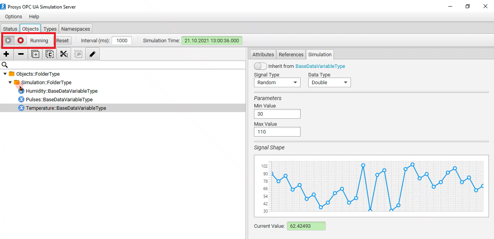
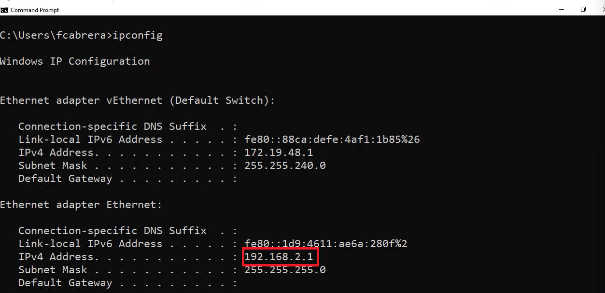
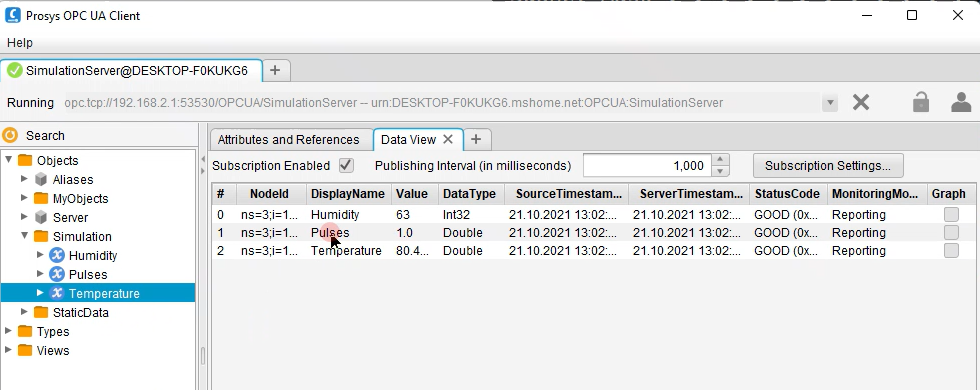

# Industrial IoT OPC UA - Multiple NIC Support

Suppose in a workflow you have a networking configuration divided into two different networks/zones. First, you have a Secure network or also defined as the offline network, which has no internet connectivity and is limited to internal access. Secondly, you have a demilitarized zone (DMZ), in which you may have a couple of devices that have limited internet connectivity. When moving the workflow to run on the EFLOW VM, you may have problems accessing the different networks since the EFLOW VM by default has only one NIC attached. 

This article describes how to configure the EFLOW VM to support multiple NICs and hence connect to multiple networks. With multiple NIC support, applications running on the EFLOW VM can communicate with devices connected to the offline network, and at the same time, use IoT Edge to send data to the cloud.

## The scenario
You have some devices like PLCs or OPC UA compatible devices connected to the offline network, and you want to upload all the device's information to Azure using the [OPC Publisher](https://docs.microsoft.com/en-us/azure/industrial-iot/overview-what-is-opc-publisher) module running on the EFLOW VM.

Since the EFLOW host device and the PLC/OPC UA devices are physically connected to the offline network, we can leverage the EFLOW multiple NIC support to connect the EFLOW VM to the offline network. Then, using an External Virtual Switch, we can get the EFLOW VM connected to the offline network and directly communicate with all the other offline devices.

On the other end, the EFLOW host device is also physically connected to the DMZ (online network), with internet and Azure connectivity. Using an Internal/External Switch, we can get the EFLOW VM connected to Azure IoT Hub using IoT Edge modules and upload the information sent by the offline devices through the offline NIC.

The following diagram shows the architecture described:

We can summarize the requirements:

- For the Secure network:
  - No internet connectivity, access restricted.
  - PLCs or UPC UA compatible devices connected.
  - EFLOW VM connected using an External virtual switch.

- For the DMZ:
  - Internet connectivity - Azure connection allowed.
  - EFLOW VM connected to Azure IoT Hub, using either an Internal/External virtual switch.
  - OPC Publisher running as a module inside the EFLOW VM used to publish data to Azure.

## Configure OPC UA devices
To test the scenario described above, we will simulate OPC UA devices. There are different OPC UA Server simulators; we will use [Prosys OPC UA Simulation Server](https://www.prosysopc.com/products/opc-ua-simulation-server/). This program will simulate OPC UA traffic that we will publish to Azure using OPC UA Publisher module. 

### Setup OPC UA Server Simulator
1. Download [Prosys OPC UA Simulation Server](https://www.prosysopc.com/products/opc-ua-simulation-server/evaluate/).
2. Run the installer.
3. Run Prosys OPC UA Simulation Server.
4. Navigate to Objects, and check the simulated parameters. If needed, change the Name and the value creation method.
5. Make sure the Simulator is running.

### Check IP configuration
1. Open a PowerShell session.
2. Run the command `ipconfig`.
3. Check the IP configuration - Make sure you get the IP Address of the switch connected to the offline network. In our case, it's the Ethernet adapter, with the IP Address 192.168.2.1

## Configure EFLOW device
The EFLOW device will act as a gateway and upload the OPC UA Simulation Server data to Azure using the OPC Publisher module. To do so, the EFLOW VM needs to be connected to both the Secure network (offline) and the DMZ network (online).
The following steps will guide you through setting up the EFLOW VM, checking connectivity with the OPC UA Simulation Server, adding a second NIC to the EFLOW VM, and finally configuring the OPC Publisher module to upload the data.

### Check connectivity to the OPC UA Simulation Server
Before installing EFLOW and connecting the OPC UA Publisher to the offline devices, we will test that the Windows host can access the OPC UA Simulation Server data. There are different OPC UA Clients; in particular, we will use [Prosys OPC UA Client](https://downloads.prosysopc.com/opc-ua-client-downloads.php). 

1. Download [Prosys OPC UA Client](https://www.prosysopc.com/opcua/apps/JavaClient/dist/3.2.0-328/prosys-opc-ua-client-3.2.0-328.exe).
2. Run the installer.
3. Run Prosys OPC UA Client.
4. Get the Connection string from the OPC UA Simulation Server.
5. Copy the Connection string inside the OPC UA Client, and connect.
6. When asked about Security Settings, choose your OPC UA Simulation Server settings (by default, None).
7. Check the incoming data under Objects -> Simulation.

### Install EFLOW
To install EFLOW, follow the instructions [Install Azure IoT Edge for Linux on Windows](https://docs.microsoft.com/en-us/azure/iot-edge/how-to-provision-single-device-linux-on-windows-symmetric?view=iotedge-2018-06&tabs=powershell) until Step 3 (Execution Policy).
Before deploying the EFLOW-VM, we will create an External Virtual switch to connect to the Secure network.

1. Open Hyper-V Manager.
2. On the right bar, select Virtual Switch Manager. 
3. On the Virtual Switch Manager window, select the New Virtual network switch on the left bar.
4. Select type _External_ and click _Create Virtual Switch_.
5. Use a name that represents the Secure network, like _OfflineUPCUA_.
6. Under _Connection Type_, select _External Network_ and select the Network Adapter connected to your Secure network.
7. Select _Apply_.

If everything is correct, we will have a new External virtual switch that we will use to connect the EFLOW VM directly to the Secure network. 

Once the external virtual switch is created, make sure to deploy the EFLOW VM using the command `Deploy-Eflow` with the recently created switch. For information about all the optional parameters available, see [PowerShell functions for IoT Edge for Linux on Windows](https://docs.microsoft.com/en-us/azure/iot-edge/reference-iot-edge-for-linux-on-windows-functions?view=iotedge-2018-06#deploy-eflow). If you are using Static IP, make sure to specify the IP parameters (-ip4Address, ip4PrefixLength, ip4GatewayAddress). For example, for our custom External Virtual Switch, with Static IP, the command would be the following: 

`Deploy-Eflow -cpuCount 2 -memoryInMb 2048 -vswitchName OfflineUPCUA -vswitchType External -ip4Address 192.168.2.4 -ip4PrefixLength 24 -ip4GatewayAddress 192.168.2.1`.

Once installation is completed, check that the EFLOW VM has connectivity with the OPC UA devices. You can check this by pinging the offline devices (make sure ICMP traffic is allowed in Windows Firewall).
1. Open an elevated PowerShell Session.
2. Connect to the EFLOW VM using the command `Connect-EflowVm`.
3. Inside the VM, do an `ifconfig` to check the eth0 interface has the correct IP configuration
4. Test connectivity by pinging the OPC UA Simulation Server device: `ping <OPC-UA-Device-IP>`

### Configure multiple NIC for EFLOW
The EFLOW VM was deployed with an External virtual switch connected to the Secure Network (offline) in the previous steps. To provision the EFLOW VM and communicate with Azure, we need to assign another NIC that is connected to the DMZ network (online). For this demo, we will assign an External Virtual Switch connected to the DMZ network.  To create the new virtual switch, follow these steps:

1. Open Hyper-V Manager.
2. On the right bar, select Virtual Switch Manager. 
3. On the Virtual Switch Manager window, select New Virtual network switch on the left bar.
4. Select type _External_ and click _Create Virtual Switch_.
5. Use a name that represents the Secure network, like _OnlineOPCUA_.
6. Under _Connection Type_, select _External Network_ and select the Network Adapter connected to your DMZ network.
7. Select _Apply_.

Once the External Virtual Switch is created, we need to attach this VM switch to the EFLOW VM. For more information, check [EFLOW Multiple NICs](https://github.com/Azure/iotedge-eflow/wiki/Multiple-NICs). For our custom new External Virtual Switch, using Static IP, the necessary commands are the following: 

1. `Add-EflowNetwork -vswitchName OnlineOPCUA -vswitchType External`
2. `Add-EflowVmEndpoint -vswitchName OnlineOPCUA -vEndpointName OnlineEndpoint -ip4Address 192.168.0.103 -ip4PrefixLength 24 -ip4GatewayAddress 192.168.0.1`

If everything is correct, we will have the _OnlineOPCUA_ switch assigned to the EFOLOW VM. To check the multiple NIC attactment, use the folllowing steps:

1. Open a PowerShell session.
2. Run the command `ipconfig`.
3. Check the IP configuration - Make sure you see the eth0 interface (connected to Secure network) and the eth1 interface (connected to DMZ network).

### Provision EFLOW and Configure OPC
