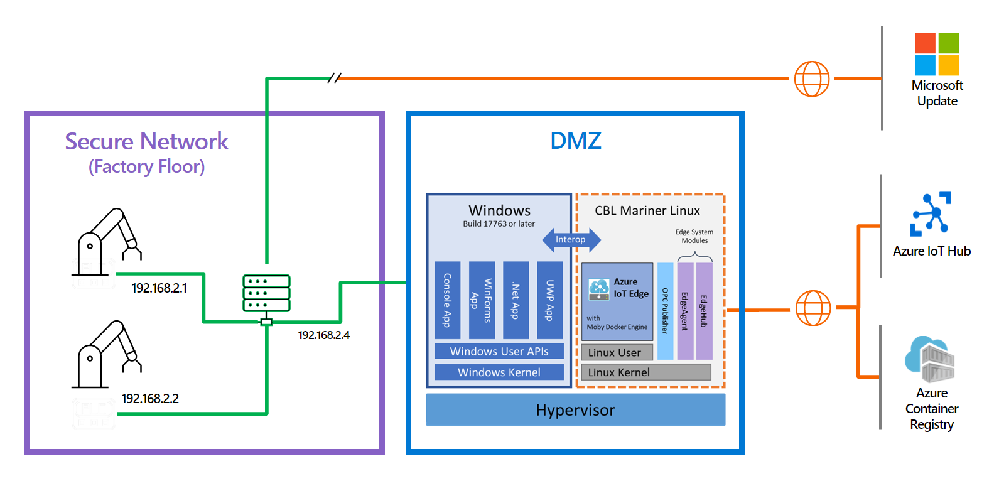

# EFLOW Industrial IoT OPC UA scenario using multiple NIC support

Suppose in a workflow you have a networking configuration divided into two different networks/zones. First, you have a Secure network or also defined as the offline network, which has no internet connectivity and is limited to internal access. Secondly, you have a demilitarized zone (DMZ), in which you may have a couple of devices that have limited internet connectivity. When moving the workflow to run on the EFLOW VM, you may have problems accessing the different networks since the EFLOW VM by default has only one NIC attached. 

This article describes how to configure the EFLOW VM to support multiple NICs and connect to multiple networks. By enabling multiple NIC support, applications running on the EFLOW VM can communicate with devices connected to the offline network, and at the same time, use IoT Edge to send data to the cloud.

## The scenario
You have some devices like PLCs or OPC UA compatible devices connected to the offline network, and you want to upload all the device's information to Azure using the [OPC Publisher](https://docs.microsoft.com/en-us/azure/industrial-iot/overview-what-is-opc-publisher) module running on the EFLOW VM.

Since the EFLOW host device and the PLC/OPC UA devices are physically connected to the offline network, we can leverage the EFLOW multiple NIC support to connect the EFLOW VM to the offline network. Then, using an External Virtual Switch, we can get the EFLOW VM connected to the offline network and directly communicate with all the other offline devices.

On the other end, the EFLOW host device is also physically connected to the DMZ (online network), with internet and Azure connectivity. Using an Internal/External Switch, we can get the EFLOW VM connected to Azure IoT Hub using IoT Edge modules and upload the information sent by the offline devices through the offline NIC.

The following diagram shows the architecture described:

We can summarize the requirements:

- For the Secure network:
  - No internet connectivity, access restricted.
  - PLCs or UPC UA compatible devices connected.
  - EFLOW VM connected using an External virtual switch.

- For the DMZ:
  - Internet connectivity - Azure connection allowed.
  - EFLOW VM connected to Azure IoT Hub, using either an Internal/External virtual switch.
  - OPC Publisher running as a module inside the EFLOW VM used to publish data to Azure.

## Prerequisites
To exercise this sample, you will need the following
* An [Azure Subscription](https://azure.microsoft.com/free/) in which you have rights to deploy resources.  

A Windows device with the following minimum requirements:
* System Requirements
   * Windows 10¹/11 (Pro, Enterprise, IoT Enterprise)
   * Windows Server 2019¹/2022  
   ¹ Windows 10 and Windows Server 2019 minimum build 17763 with all current cumulative updates installed.
* Hardware requirements
  * Minimum Free Memory: 1 GB
  * Minimum Free Disk Space: 10 GB

## Instructions
[Step 1 - Setup OPC UA Devices](./Documentation/Setup%20OPC%20UA%20Devices.MD)  
[Step 2 - Install Azure IoT Edge for Linux on Windows (EFLOW)](./Documentation/Install%20Azure%20IoT%20Edge%20for%20Linux%20on%20Windows.MD)  
[Step 3 - Configure EFLOW Multiple NIC](./Documentation/)  
[Step 4 - Provision EFLOW and Configure OPC Publisher](./Documentation/Develop%20the%20Windows%20C%23%20Console%20Application.MD)  
[Troubleshooting](./Documentation/Troubleshooting.MD)  

## Feedback
If you have problems with this sample, please post an issue in this repository.